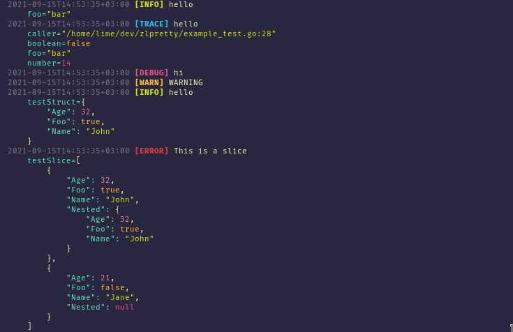

## ❗Archiving this project for [github.com/lime008/liitu](https://github.com/lime008/liitu) that also provides a slog handler.

### Forked from [github.com/UnnoTed/horizontal](https://github.com/UnnoTed/horizontal)

zlpretty is a pretty logging with focus on readability, based on the `zerolog.ConsoleWriter` but with some added features like json pretty printing.



`go get -u github.com/lime008/zlpretty`

```go
package main

import (
	"os"

	"github.com/lime008/zlpretty"
	"github.com/rs/zerolog/log"
)

func main() {
	log.Logger = log.Output(zlpretty.ConsoleWriter{Out: os.Stderr})
	log.Debug().Msg("hi")
	log.Debug().Msg("hello")
}

```
